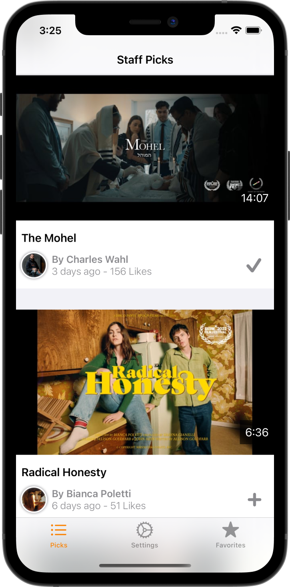

# Picks
Search and save videos using Vimeo public Api.  

## 1. Arquitecture
The project uses **VIPER** Design Pattern. The main modules are:

1. Picks
2. Settings
2. Favorites

## 2. Persistence
The data saved by the user is stored locally with Core Data.

